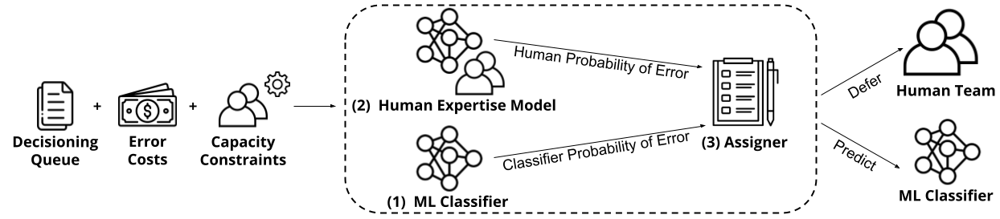

# **DeCCaFF**

## Abstract

The *learning to defer* (L2D) framework aims to improve human-AI collaboration systems by deferring decisions to humans when they are more likely to make the correct judgment than a ML classifier. Existing research in L2D overlooks key aspects of real-world systems that impede its practical adoption, such as: i) neglecting cost-sensitive scenarios; ii) requiring concurrent human predictions for every instance of the dataset in training and iii) not dealing with human capacity constraints. To address these issues, we propose the *deferral under cost and capacity constraint framework* (DeCCaF). A novel L2D approach: DeCCaF employs supervised learning to model the probability of human error with less restrictive data requirements (only one expert prediction per instance), and uses constraint programming to globally minimize error cost subject to capacity constraints. We employ DeCCaF in a cost-sensitive fraud detection setting with a team of 50 synthetic fraud analysts, subject to a wide array of realistic human work capacity constraints, showing that DeCCaF significantly outperforms L2D baselines, reducing average misclassification costs by 9 \%. Our code and testbed are available at https://anonymous.4open.science/r/deccaf-1245/

## Overview

* [Resources](#Resources)
* [Setting up Code](#DeCCaF Code)
* [Replicating our results](#Replicating-our-results)
* [Notebooks](#Notebooks)

## Resources
In this repo, we provide users with:

* Code used to run experiments.
* [Datasets and models](https://drive.google.com/file/d/1R6NgMgLd4wrRiQz5WrZUzFx0ljCHgDZl/view) used in our experiments.

The submitted version of the paper,and the appendix are available [here](Documents/paper.pdf).

## DeCCaF Code

In this section we go through the steps to obtain the code and data used to:

* Generate Synthetic Experts
* Generate Capacity Constraints
* Train a ML Classifier
* Train the DeCCaF method
* Train our adaptation of the OvA method
* Assign Under Capacity Constraints

 ### Step 1: Download the Code in this repo:
The sets of capacity constraint tables and the synthetic expert prediction table are generated by using the input dataset and a set of configs included in this repo. For easy use of our dataset and available notebooks, we encourage users to download the repo in its entirety.

 ### Step 2: Install the Dependencies needed:

To run our code we include a ".whl" file [here](Dependencies/). This package is necessary for the generation of our synthetic experts and training our human expertise model. 

 ### Step 3: Download the Input Dataset
Our input dataset is the base variant of the Bank Account Fraud Tabular Dataset, available [here](https://www.kaggle.com/datasets/sgpjesus/bank-account-fraud-dataset-neurips-2022?resource=download&select=Base.csv). This dataset should then be placed in the folder [DeCCaF/data](DeCCaF/data).

 ### Step 4: Download the Models, Training Datasets and other necessary data
The models used in our experiments and the dataset with limited expert predictions are available [here](https://drive.google.com/file/d/1R6NgMgLd4wrRiQz5WrZUzFx0ljCHgDZl/view). We also include the transformed input dataset in order to generate synthetic experts. 

 ### Step 5: Load data and Generate Expert Decisions and Capacity Constraints

To place all the necessary data in the correct directories the user needs to run "[load\_data.py](load_data.py)". The script only requires the user to specify the directory of the datasets downloaded in Step 4.

The script will then run, in order:

* [ML classifier training script](DeCCaF/ml_model/training_and_predicting.py) - verifying the existence of the necessary files and obtaining the model score for each instance
* [Expert generation script](DeCCaF/experts/expert_gen.py) - generating our team of synthetic experts
* [Testset generation script](DeCCaF/testbed/testbed_test_generation.py) - generating the set of capacity constraints to be used in testing

The rest of the necessary materials are included in the downloaded data, as the model training and deferral process take extensive amounts of time. The model training and deferral processes are done by the following files:

* [Human expertise model training script](DeCCaF/expertise_models/training.py) - trains/loads the human expertise models, generating the predictions for probability of error
* [OvA classifiers training script](DeCCaF/expertise_models/training.py) - trains/loads the OvA classifiers, generating the model's output
* [Deferral script](DeCCaF/run_alert.py) - runs the deferral utilizing the results generated by the previous scripts 

## Replicating our results

### Model Training
If a user chooses to re-train the ML Model, human expertise model, or OvA classifiers, the results may slightly differ, as we used multiple cores in training, which, as stated in the LightGBM documentation, may lead to slightly different results in each run.

### Deferral Results
After following the steps detailed in the previous section, the user can run [run_alert.py](DeCCaF/run_alert.py). This script produces the test split assignments for each testing scenario generated in Step 5 of the previous section. These assignments are obtained by using DeCCaF or each of the baselines detailed in Section 5 of the [paper](Documents/paper.pdf).

If the user uses the included models and generated experts, these results will be identical to those included in the paper.

## Notebooks

We include notebooks to facilitate analysis of:

* Synthetic Experts' Decisions
* ML Model, Human Expertise Model and OvA Classifiers
* Deferral Results

### Synthetic Experts' Decisions

The plots and numerical results regarding our synthetic expert's generation process and decision properties are obtained using the notebook [DeCCaF/experts/expert_properties.ipynb](DeCCaF/experts/expert_properties.ipynb). 

### ML Model, Human Expertise Model and OvA Classifiers

The plots, numerical results, and hyperparameter choices relating to our ML model, detailed in Section C.1 of the appendix, are obtained using the script [DeCCaF/ml_model/training_and_predicting.py](DeCCaF/ml_model/training_and_predicting.py). 

The plots, numerical results, and hyperparameter choices relating to our Human Expertise model, detailed in Section D.1, are obtained using the notebook [DeCCaF/expertise_models/model_analysis.ipynb](DeCCaF/expertise_models/model_analysis.ipynb). 

The plots, numerical results, and hyperparameter choices relating to the OvA classifiers, detailed in Section D.2, are obtained using the notebook [DeCCaF/ova_models/model_analysis.ipynb](DeCCaF/ova_models/model_analysis.ipynb). 

### Deferral Results
Thes results detailed in Section 5 of the [paper](Documents/paper.pdf) can be obtained by running the notebook [DeCCaF/alert_review.ipynb](DeCCaF/ova_models/model_analysis.ipynb). This notebook generates the tables seen in section 5, as well as many other relevant statistics that were not included for brevity.
