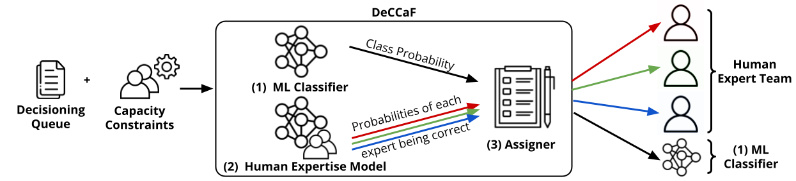

  
# Cost-Sensitive Learning to Defer to Multiple Experts with Workload Constraints

## Abstract

*Learning to defer* (L2D) aims to improve human-AI collaboration systems by deferring decisions to humans when they are more likely to make the correct judgment than a ML classifier. Existing research in L2D overlooks key aspects of real-world systems that impede its practical adoption, such as: i) neglecting cost-sensitive scenarios, where type 1 and type 2 errors have separate costs; ii) requiring concurrent human predictions for every instance of the dataset in training and iii) not dealing with human work capacity constraints. To address these issues, we propose the *Deferral under Cost and Capacity Constraints Framework* (DeCCaF) - a novel L2D approach, employing supervised learning to model the probability of human error with less restrictive data requirements (only one expert prediction per instance), and using constraint programming to globally minimize error cost subject to workload constraints. We test DeCCaF in a series of cost-sensitive fraud detection scenarios with different teams of 9 synthetic fraud analysts, with individual work capacity constraints. We demonstrate that our approach performs significantly better than the baselines in a wide array of scenarios, achieving an average reduction in the misclassification cost of 8.4%.


## Overview

* [Resources](#Resources)
* [Replicating Results](#Replicating-Results)
* [Notebooks](#Notebooks)

## Resources
In order to ensure complete reproducibility, we provide users with:
* Code used to run experiments.
* [Datasets, models and results](https://drive.google.com/file/d/16BLuZzdBLOsjs77WtytS7hZqe7aPDyTX/view?usp=sharing) used/produced in our experiments.
   * Synthetically Generated Data - Expert predictions, training scenarios and capacity constraints
   * ML models - Alert Model, OvA Classifiers and Human Expertise Model
   * Results - Set of assignments and decisions resulting from the deferral experiments

*Note*: This data is included due to the fact that LightGBM models are known to produce different results depending on operating system, python versions, number of cores in training, among other factors

The submitted version of the paper and the appendix are available [here](Documents/Paper.pdf).

### Creating the Python Environment

Requirements:
* anaconda3
  
Before using any of the provided code, to ensure reproducibility, please create and activate the Python environment by running

```
conda env create -f environment.yml
conda activate deccaf-env
```

## DeCCaF Code

To replicate the generation of the synthetic data, as well as our experiments, please execute the following steps:

**Attention**: Run each python script **inside** the folder where it is located, to ensure the relative paths within each script work correctly

### Step 1 - Clone the Repo and Download Dataset
After cloning the repo, please extract the [Datasets, models and results](https://drive.google.com/file/d/16BLuZzdBLOsjs77WtytS7hZqe7aPDyTX/view?usp=sharing) file inside the repo's folder, ensuring that your directory looks like this

```
deccaf
│   README.md
│   .gitignore  
│   environment.yml
│
└─── Code
│   │   ...
│   
└─── Data_and_models
    │   ...
```

### Step 2 - Activate the Environment
To activate the Python environment with the necessary dependencies please follow [these steps](#Creating-the-Python-Environment)

### Step 3 - Train the Alert Model and create the set of alerts
To train the Alert Model, run the file [Code/alert_model/training_and_predicting.py](Code/alert_model/training_and_predicting.py), which will train the Alert Model and score all instances in months 4-8 of the BAF dataset.

Then, run the file [Code/alert_data/preprocess.py](Code/alert_data/preprocess.py), to create the dataset of 30K alerts raised in months 4-8. This will be the set of instances used over all following processes.

### Step 4 - Train classifier *h*
As both DeCCaF and OvA share the classifier *h*, we train it first, by running the script [Code/classifier_h/training.py](Code/classifier_h/training.py).
The classifier is trained first due to the fact that its performance is used as a reference to generate experts with a similar misclassification cost.

### Step 5 - Train DeCCaF and OvA systems
To train the DeCCaF system run the script [Code/expert_models/run_deccaf.py](Code/expert_models/run_deccaf.py). To train the OvA system run the script [Code/expert_models/run_ova.py](Code/expert_models/run_ova.py).

### Step 6 - Run the Deferral Experiments

To reproduce the deferral testing run the script [Code/deferral/run_alert.py](Code/deferral/run_alert.py). These results can then be evaluated with the notebook [Code/deferral/process_results.ipynb](Code/deferral/process_results.ipynb)

## Notebooks

We include notebooks to facilitate analysis of:

* Synthetic Experts' Decisions
* ML Model, Human Expertise Model and OvA Classifiers
* Deferral Results

We also facilitate further analysis of our generated experts and the conducted benchmarks, by providing users with two Jupyter Notebooks
* [Code/deferral/process_results.ipynb](Code/deferral/process_results.ipynb) - which contains
  * evaluation of the deferral performance of all considered L2D baselines
  * evaluation of the performance and calibration of Classifier *h*, OvA Classifiers, and DeCCaF's team correctness prediction models.
* [Code/synthetic_experts/expert_analysis.ipynb](Code/synthetic_experts/expert_analysis.ipynb) - which contains the evaluation of the expert decision-making process properties.
